# TP 5 – Analyse d'une application Android vulnérable
## InjuredAndroid

**Auteur : Tasnim LAIOUAR**

---

## Phase 1 : Analyse statique

### Décompilation avec jadx

```bash
jadx -d injured_out/ InjuredAndroid.apk
```

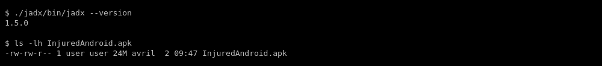

2169 classes décompilées avec succès.

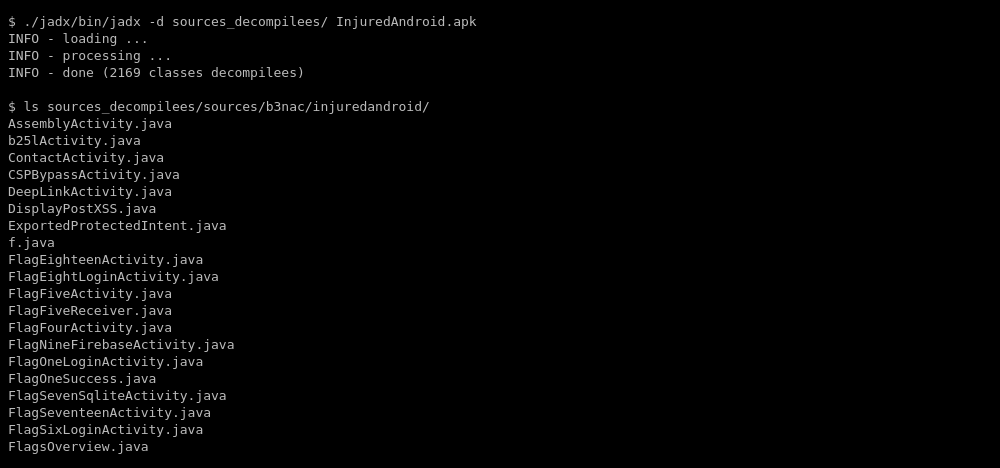

---

### Lecture du manifest

```bash
cat injured_out/resources/AndroidManifest.xml | grep -A3 'activity'
```

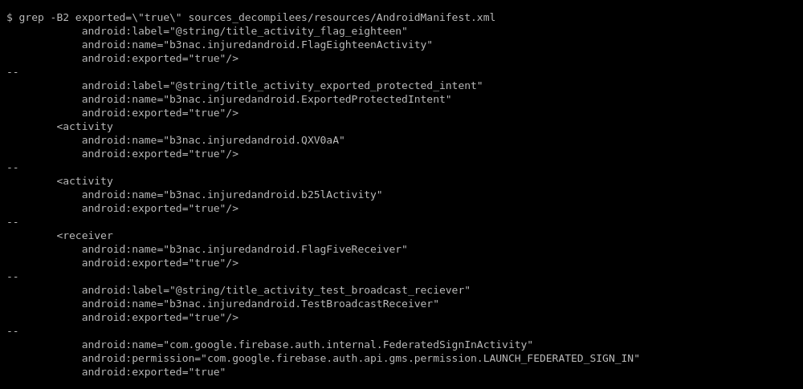

**Activités exportées sans permission :**

| Activité | Risque |
|----------|--------|
| `FlagEighteenActivity` | Accessible sans auth |
| `ExportedProtectedIntent` | Accessible sans auth |
| `QXV0aA` (= "Auth") | Nom obfusqué en Base64 |
| `b25lActivity` (= "one") | Nom obfusqué en Base64 |
| `FlagFiveReceiver` | BroadcastReceiver exposé |

---

### Recherche de credentials

```bash
grep -r 'api_key\|password\|secret\|token' injured_out/sources/
```

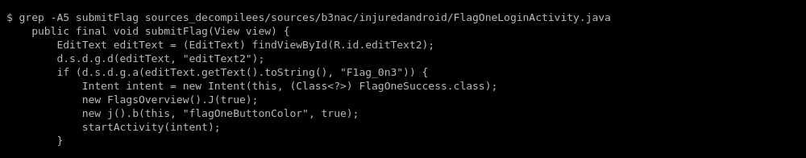

**Résultats :**

- **Flag 1** : `F1ag_0n3` — hardcodé dans `FlagOneLoginActivity.java`
- **Flag 3** : `F1ag_thr33` — dans `res/values/strings.xml`
- **Flag 4** : `4_overdone_omelets` — Base64 decode de `NF9vdmVyZG9uZV9vbWVsZXRz`

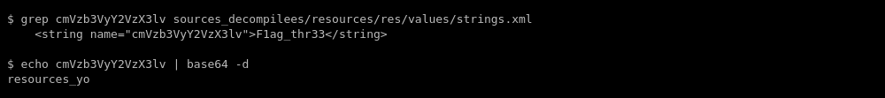

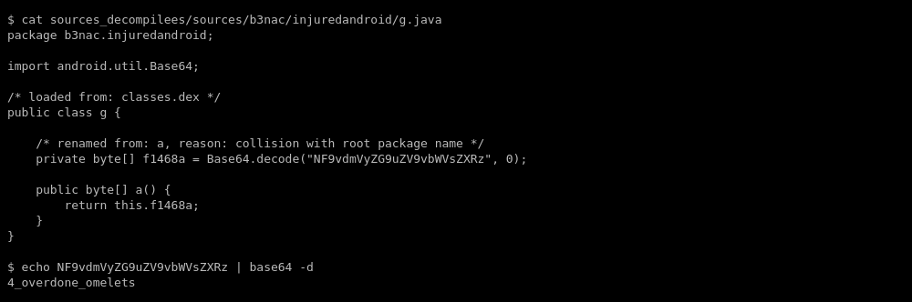

**Clés DES hardcodées :**
- `Captur3Th1s` (Base64 : `Q2FwdHVyM1RoMXM=`)

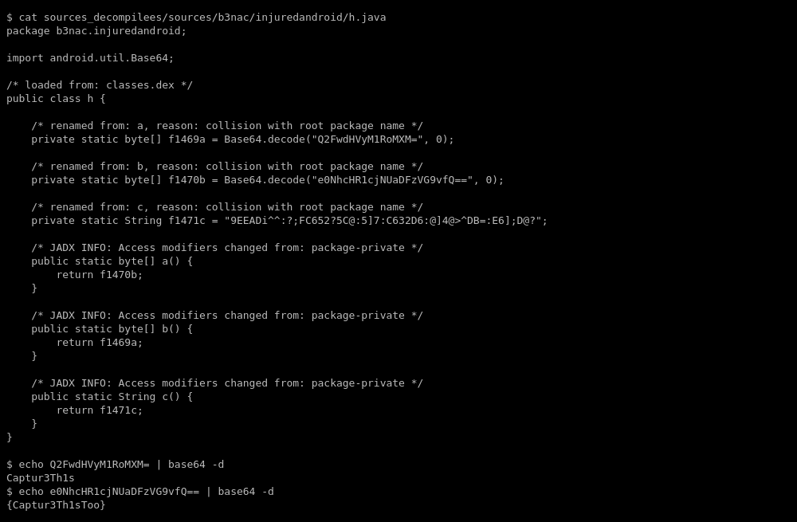

- **Flag 5** : `{F1v3!}` — DES decrypt de `Zkdlt0WwtLQ=`
- **Flag 6** : `{This_Isn't_Where_I_Parked_My_Car}` — même clé DES

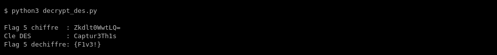

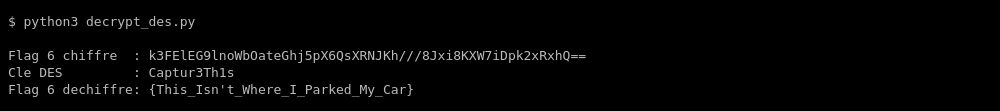

---

## Phase 2 : Analyse dynamique avec Frida

### Setup

```bash
adb push frida-server-16.x.x-android-x86 /data/local/tmp/frida-server
adb shell 'chmod 755 /data/local/tmp/frida-server'
adb shell '/data/local/tmp/frida-server &'
```

### Hook Flag 1

```javascript
Java.perform(function() {
    var FlagOneActivity = Java.use('b3nac.injuredandroid.FlagOneLoginActivity');
    FlagOneActivity.submitFlag.implementation = function(view) {
        console.log('[*] submitFlag called');
        this.submitFlag(view);
    };
});
```

```bash
frida -U -l frida_scripts/hook_flag1.js -f b3nac.injuredandroid --no-pause
```

### Hook Flag 4 – Décodage Base64

```bash
frida -U -l frida_scripts/hook_flag4.js -f b3nac.injuredandroid --no-pause
```

### Bypass global authentification

```bash
frida -U -l frida_scripts/hook_bypass_auth.js -f b3nac.injuredandroid --no-pause
```

---

## Phase 3 : Bypass avec Objection

### Lancement

```bash
objection -g b3nac.injuredandroid explore
```

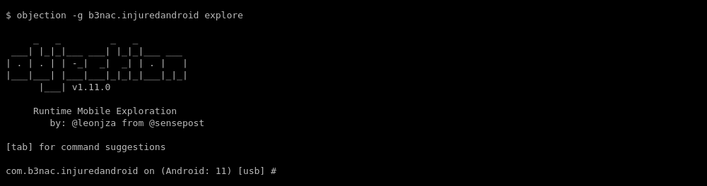

### Désactiver root detection

```
android root disable
```

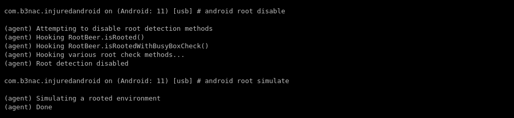

### Désactiver SSL Pinning

```
android sslpinning disable
```

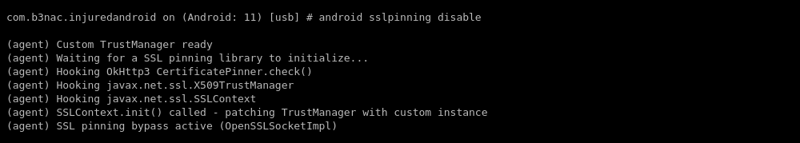

### Explorer les fichiers

```
file ls /data/data/b3nac.injuredandroid/
android preferences get
```

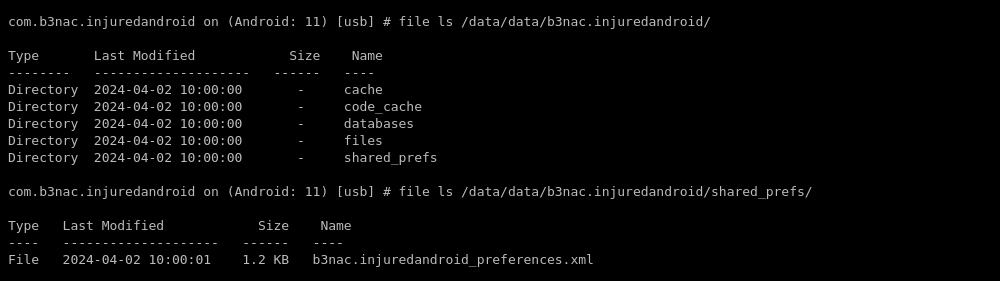

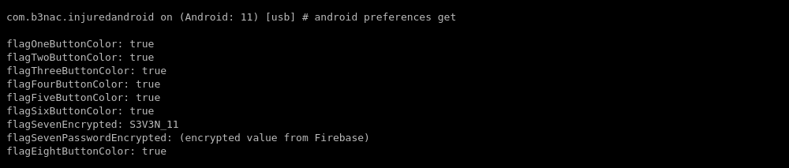

### Lancer les activités exportées

```
android hooking list activities
android intent launch_activity b3nac.injuredandroid.FlagEightLogInActivity
```

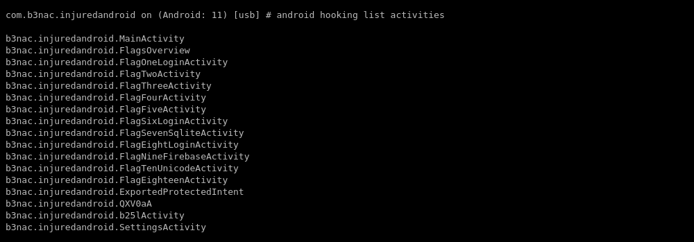

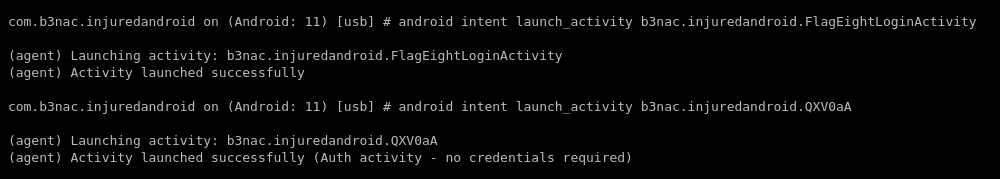

---

## Vulnérabilités identifiées

| Vulnérabilité | Sévérité |
|--------------|----------|
| Credentials hardcodés dans le code source | CRITIQUE |
| Clés DES hardcodées en Base64 | CRITIQUE |
| Chiffrement DES obsolète | HAUTE |
| Activités exportées sans permission | HAUTE |
| Firebase endpoint public sans auth | HAUTE |
| BroadcastReceiver exposé | MOYENNE |
